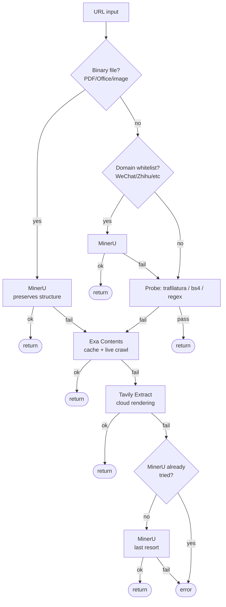

# content-extract

Intelligent URL content extraction skill for the [search-skills](../../README.md) plugin. Converts any URL into clean text/Markdown through a multi-layer extraction pipeline with automatic fallback.

## Decision Tree

## Extraction Paths

| URL Type | Fallback Order | Rationale |
|----------|----------------|-----------|
| **Binary files** (PDF, Office, images) | MinerU → Exa → Tavily | MinerU preserves document structure (tables, formulas, OCR) |
| **Whitelisted domains** (WeChat, Zhihu, etc.) | MinerU → Probe → Exa → Tavily | These anti-crawl sites are specifically optimized for MinerU |
| **Normal URLs** | Probe → Exa → Tavily → MinerU | Free/fast probe first; Exa cache for anti-crawl; MinerU as last resort |

## Extraction Methods

| Method | Type | Speed | Cost | Best For |
|--------|------|-------|------|----------|
| **Probe** (trafilatura / bs4 / regex) | Local | Fastest | Free | Standard HTML pages |
| **Exa Contents** | Cloud API | Fast (cached) | Paid | Cached pages; live crawl fallback |
| **Tavily Extract** | Cloud API | Fast | Paid | JS-rendered pages |
| **MinerU** | Cloud API | Slow (async polling) | Paid | PDFs, Office docs, OCR, table extraction |

## Design Decisions

- **Probe first for normal URLs**: Most pages are standard HTML. Using the free local extractor avoids unnecessary API calls.
- **MinerU first for binary/whitelisted**: MinerU produces the highest-quality output for documents (preserving structure, tables, and formulas) and for specific anti-crawl sites it's been optimized for.
- **Exa before Tavily**: Exa uses a cache-first approach with live crawl fallback. Tavily provides cloud rendering as an additional fallback.
- **MinerU last for normal URLs**: When probe and cloud services fail, MinerU's document parsing engine is tried as last resort.
- **No duplicate MinerU calls**: If MinerU was already tried in the binary/whitelist step, it's skipped in the fallback chain.

## Anti-Crawl Detection

The probe step includes heuristic checks that trigger fallback:

1. **Keyword detection** — Response contains known anti-crawl phrases (e.g., "enable javascript", "checking your browser", "captcha")
2. **Minimum length** — Extracted content shorter than 800 characters is considered incomplete

See `_ANTICRAWL_KEYWORDS` in [`content_extract.py`](../../scripts/content-extract/content_extract.py) for the full keyword list.

## Domain Whitelist

Certain domains always skip the probe and go directly to MinerU, because they are known to require server-side rendering:

- `mp.weixin.qq.com` — WeChat articles
- `zhihu.com` / `zhuanlan.zhihu.com` — Zhihu
- `xiaohongshu.com` / `xhslink.com` — Xiaohongshu
- `bilibili.com` — Bilibili

See [`references/domain-whitelist.md`](../../references/domain-whitelist.md) for the full list. The whitelist is loaded at runtime and can be extended without code changes.

## Files

| File | Purpose |
|------|---------|
| `SKILL.md` | Skill definition loaded by Claude Code (usage examples, output contract) |
| [`../../scripts/content-extract/content_extract.py`](../../scripts/content-extract/content_extract.py) | Main extraction script with all extraction methods and fallback logic |

## Environment Variables

All API keys are optional. The script uses whichever services are configured and skips the rest.

| Variable | Used By | Default |
|----------|---------|---------|
| `TAVILY_API_KEY` | Tavily Extract API | — |
| `TAVILY_API_URL` | Custom Tavily base URL | `https://api.tavily.com` |
| `EXA_API_KEY` | Exa Contents API | — |
| `EXA_API_URL` | Custom Exa base URL | `https://api.exa.ai` |
| `MINERU_TOKEN` | MinerU parsing API | — |

## Dependencies

- `requests` — HTTP client
- `trafilatura` — Primary content extractor
- `beautifulsoup4` + `lxml` — Fallback extractor
